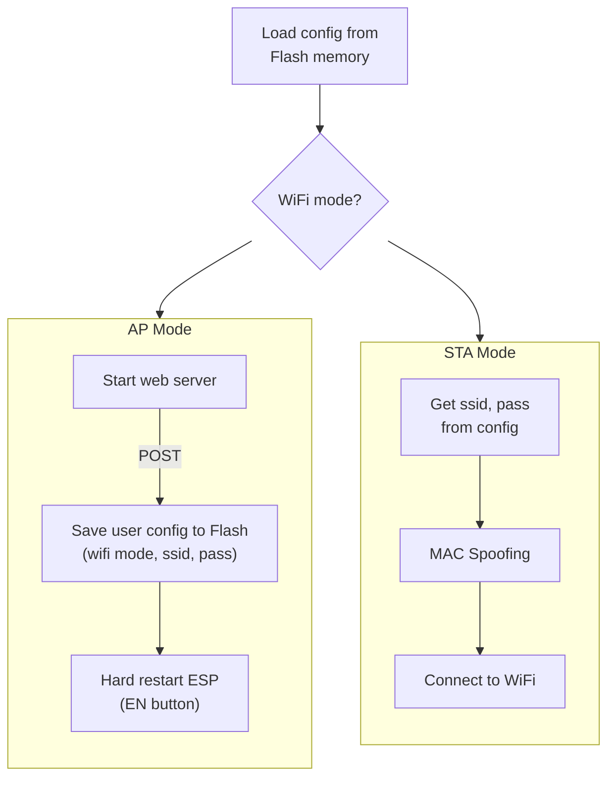

# ESP WIFI MODULE

## Description
ESP32 WiFi management: STA, AP, Flash config, MAC spoofing.

## Environment
+ IDE: Visual Studio Code + Platform IO (Arduino Framework)
+ Architecture: 
  + ESP32 DevKit-V1

## Features
+ WiFi Station mode (STA) & Access Point mode (AP).
+ Persistent configuration (Flash memory).
+ MAC address spoofing (STA mode).
+ Web-based configuration portal (AP mode).

## Workflow

## References
[1] [neittien0110/FineDustMonitor](https://github.com/neittien0110/FineDustMonitor)  
[2] [neittien0110/siotcore_sdk_v2](https://github.com/neittien0110/siotcore_sdk_v2)  
